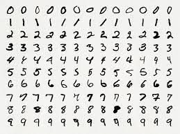
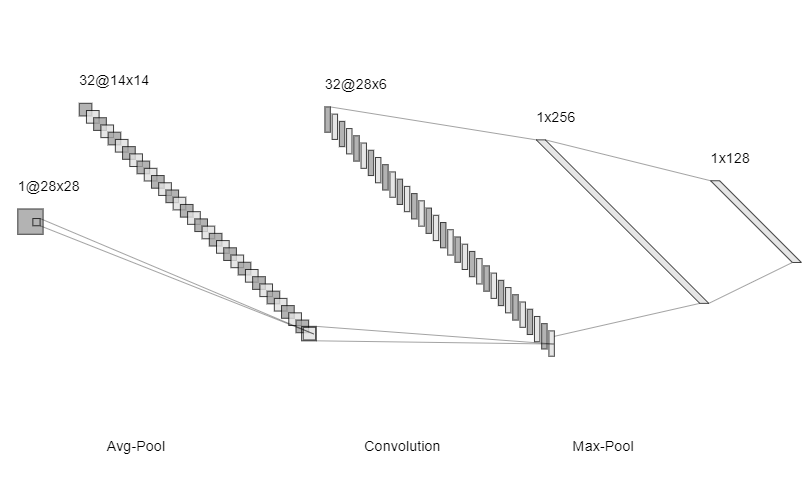
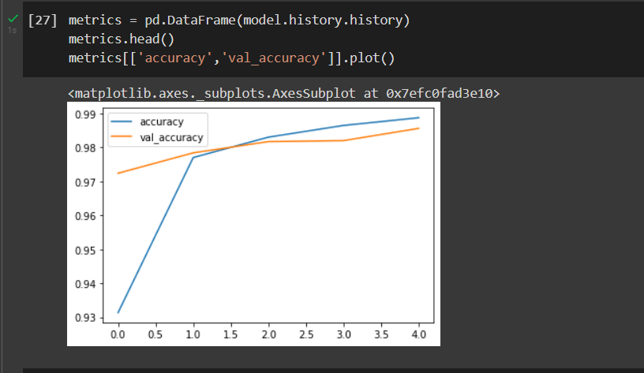
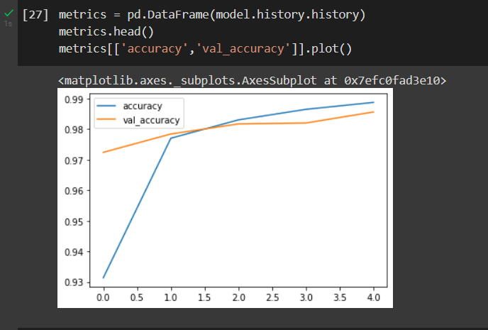
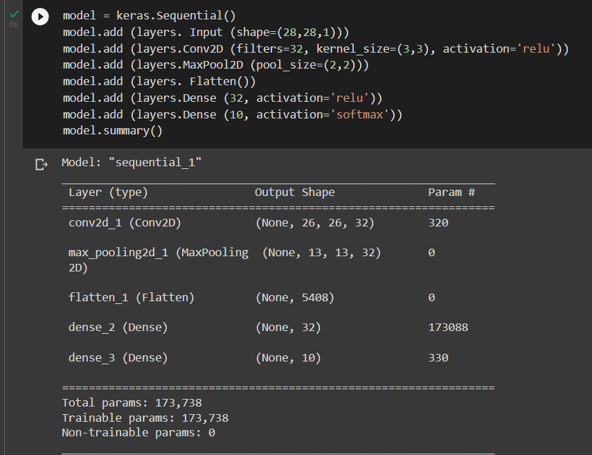
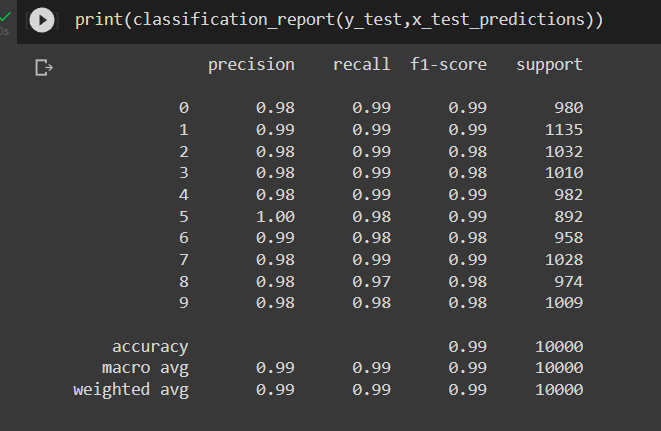
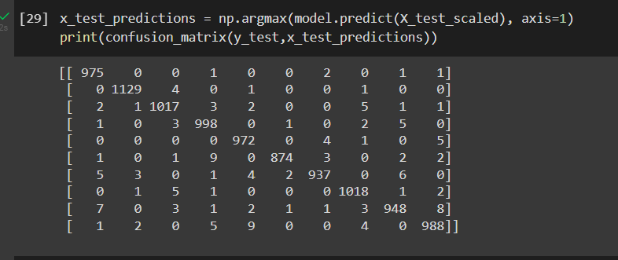

# Convolutional Deep Neural Network for Digit Classification

## AIM:

To Develop a convolutional deep neural network for digit classification and to verify the response for scanned handwritten images.

## Problem Statement:
The MNIST dataset is a collection of handwritten digits. The task is to classify a given image of a handwritten digit into one of 10 classes representing integer values from 0 to 9, inclusively. The dataset has a collection of 60,000 handwrittend digits of size 28 X 28. Here we build a convolutional neural network model that is able to classify to it's appropriate numerical value.

## Dataset:


## Neural Network Model:



## PROCEDURE:

### STEP 1:
Import tensorflow and preprocessing libraries.

### STEP 2:
Download and load the dataset.

### STEP 3:
Scale the dataset between it's min and max values.

### STEP 4:
Using one hot encode, encode the categorical values

### STEP 5:
Split the data into train and test

### STEP 6:
Build the convolutional neural network model

### STEP 7:
Train the model with the training data

### STEP 8:
Plot the performance plot

### STEP 9:
Evaluate the model with the testing data

### STEP 10:
Fit the model and predict the single input

## PROGRAM:
```python
# Developed By:Silambarasaban K
# Register Number:212221230101
import numpy as np
from tensorflow import keras
from tensorflow.keras import layers
from tensorflow.keras.datasets import mnist
import tensorflow as tf
import matplotlib.pyplot as plt
from tensorflow.keras import utils
import pandas as pd

from sklearn.metrics import classification_report,confusion_matrix
from tensorflow.keras.preprocessing import image

(X_train, y_train), (X_test, y_test) = mnist.load_data()

X_train.shape
X_test.shape

single_image= X_train[0]
single_image.shape

plt.imshow(single_image,cmap='gray')

y_train.shape

X_train.min()
X_train.max()

X_train_scaled = X_train/255.0
X_test_scaled = X_test/255.0

X_train_scaled.min()
X_train_scaled.max()

y_train[0]

y_train_onehot = utils.to_categorical(y_train,10)
y_test_onehot = utils.to_categorical(y_test,10)

type(y_train_onehot)

y_train_onehot.shape
single_image = X_train[500]
plt.imshow(single_image,cmap='gray')

y_train_onehot[500]
X_train_scaled = X_train_scaled.reshape(-1,28,28,1)
X_test_scaled = X_test_scaled.reshape(-1,28,28,1)

model = keras.Sequential()
model.add(layers.Input(shape=(28,28,1))) 
model.add(layers.Conv2D(filters=32,kernel_size=(3,3),padding="same",activation='relu'))
model.add(layers.AvgPool2D (pool_size=(2,2)))
model.add(layers.Flatten())
model.add(layers.Dense(32,activation='tanh')) 
model.add(layers.Dense(10, activation ='softmax'))
model.summary()

model.compile(optimizer='Adam',
              loss='categorical_crossentropy',
              metrics=['accuracy'])

model.fit(X_train_scaled ,y_train_onehot, epochs=5,
          batch_size=64, 
          validation_data=(X_test_scaled,y_test_onehot))   

metrics = pd.DataFrame(model.history.history)  
metrics.head()
metrics[['accuracy','val_accuracy']].plot()
metrics.plot()

metrics[['loss','val_loss']].plot()

x_test_predictions = np.argmax(model.predict(X_test_scaled), axis=1)
print(confusion_matrix(y_test,x_test_predictions))

img = image.load_img('img0.jpg')
type(img)
img = image.load_img('img0.jpg')
img_tensor = tf.convert_to_tensor(np.asarray(img))
img_28 = tf.image.resize(img_tensor,(28,28))
img_28_gray = tf.image.rgb_to_grayscale(img_28)
img_28_gray_scaled = img_28_gray.numpy()/255.0

x_single_prediction = np.argmax(
    model.predict(img_28_gray_scaled.reshape(1,28,28,1)),
     axis=1)

print(x_single_prediction)
plt.imshow(img_28_gray_scaled.reshape(28,28),cmap='gray')
```

## OUTPUT:

### Training Loss, Validation Loss Vs Iteration Plot



### summary


### Classification Report



### Confusion Matrix



### New Sample Data Prediction


## RESULT:
Thus,a convolutional deep neural network for digit classification is developed and the response for scanned handwritten images is verified.
